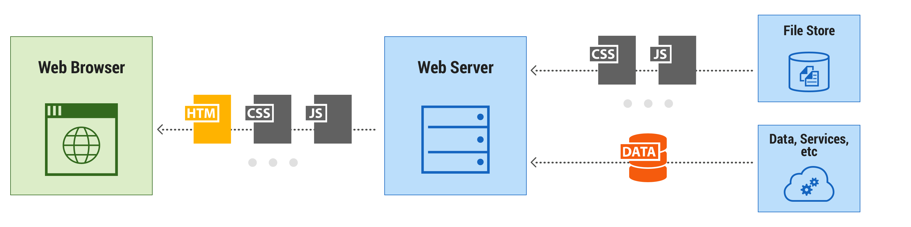

# XSS Prevention

## Giải pháp chống XSS

### Mục lục

* [Sử dụng flag HTTPOnly cookie và flag Secure cookie](#HTTPOnly)
* [Sử dụng Implement Content Security Policy cho trang web](#csp)
* [Hãy chắc chắn rằng X-XSS-Protection đã được bật](#xxp)
* [HTTP Strict Transport Security (HSTS), Hãy sử dụng HTTPS thay vì HTTP](#https)
* [Đừng quá tin tưởng vào những gì mà client nhập. Luôn luôn escape dữ liệu được đưa vào từ ngoài và khi hiển thị lên trang web](#escape)
* [Nên sử dụng thư viện được tích hợp sẵn để lọc dữ liệu hợp lệ, không nên tự viết lại](#filter)


<a name = "HTTPOnly"></a>
### Sử dụng flag HTTPOnly cookie và flag Secure cookie

- Cấu trúc của 1 HTTP response header đối với cookie sẽ là:

```
Set-Cookie: <name>=<value>[; <Max-Age>=<age>][; expires=<date>][; domain=<domain_name>][; path=<some_path>][; secure][; HttpOnly]
```
- Để sử dụng 2 flag này chỉ đơn giản set giá trị cho chúng bằng true.

- HTTPOnly:
    + Cookie có flag HTTPOnly sẽ không thể truy cập thông qua hàm document.cookie. Do đó, dù web có bị lỗi XSS thì attacked không thể đánh cắp được nó.
    + Hay nói cách khác HttpOnly có tác dụng làm cho cookie chỉ được thao tác bởi server mà không bị thao tác bởi các script phía client. Do đó hạn chế bị truy cập bởi các non-HTTP APIs chẳng hạn như Javascript. Việc hạn chế này làm giảm nhẹ nhưng không loại trừ việc đánh cắp cookie thông qua lỗ hổng Cross-site scripting (XSS).
    + Với PHP, để set vĩnh viễn flag HTTPOnly luôn bật trong HTTP header ta chỉ cần vào file php.ini và chỉnh sửa:

     `session.cookie_httponly = True`

- Secure:
    + Secure có tác dụng làm cho trình duyệt phải sử dụng kết nối secure/encrypted tức là kết nối bảo mật, được mã hóa. Tuy vậy, nó chỉ hoạt động khi server có sử dụng SSL(HTTPs). Tuy vậy, không nên truyền các thông tin bảo mật bằng Cookie vì cơ chế này vốn dĩ không an toàn và kể cả có Secure đi chăng nữa thì ko có nghĩa là thông tin nào cũng được mã hóa hoặc không thể truy cập bởi bên thứ 3.
    + Với PHP, để set vĩnh viễn flag HTTPOnly luôn bật trong HTTP header ta chỉ cần vào file php.ini và chỉnh sửa:

     `session.cookie_secure = True`

- Sau khi khi set `true` cho 2 flag trên, nên dùng 1 trình intercepting proxy nào đố để kiểm tra lại file header hay chỉ đơn giản là F12 để kiểm tra lại Request Headers xem 2 flag này đã được bật chưa.


---

<a name = "csp"></a>
### Sử dụng Implement Content Security Policy cho trang web

- Content Security Policy (CSP) là chính sách bảo mật nội dung, được sử dụng để xác định các nguồn nội dung an toàn trên website mà trình duyệt có thể tải về cho client. CSP là biện pháp đối phó rất hiệu quả với kiểu attack chèn mã độc Cross Site Scripting (XSS) vào trang web.
- Khi truy cập vào một trang web, trình duyệt sẽ gửi yêu cầu tải nội dung đến server. Server sẽ gửi trả lại nội dung của trang web này cho trình duyệt, trong đó bao gồm các file CSS, Javascript, Font, Frame … Trình duyệt sẽ tải toàn bộ những file này, vì nó được chỉ định phải làm như vậy từ mã nguồn của trang web để có thể hiển thị nội dung.



- Và attacker có thể lợi dụng điều này để thực hiện các cuộc tấn công liên quan tới XSS.
- Nếu trang web sử dụng CSP, lúc này trang web sẽ:
    + Tạo một danh sách CSP cho phép dev chỉ định các nguồn nội dung an toàn mà trình duyệt có thể tải. Bằng cách này dev có thể bảo vệ client thoát khỏi đa số các cuộc tấn công liên quan tới XSS.
        * Nguồn nội dung an toàn: Đó là nguồn mà dev biết rõ nó từ đâu đến. Ví dụ như những file Javascript được tải từ các dịch vụ của Google, Google Analystics, Google reCapcha, Google Map, Google Fonts, Fackebook, Twitter, Pinterest, Cloudflare … Hoặc những file nằm trong mã nguồn web.
        * Những file nguồn không nằm trong danh sách, trình duyệt sẽ không tải và không thực thi.
- Cú pháp set Implement Content Security Policy cho trang web:

`Content-Security-Policy: default-src 'none';`

- Với PHP, set Implement Content Security Policy theo 2 cách:
    + Đặt trong hàm header: `header("Content-Security-Policy: default-src 'none';");`
    + Đặt trong thẻ meta  : `<meta http-equiv="Content-Security-Policy" content="default-src 'none' ;" >`

---

<a name = "xxp"></a>
### Hãy chắc chắn rằng X-XSS-Protection đã được bật

- X-XSS-Protection là một tính năng của trình duyệt Chrome và Internet Explorer, được thiết kế để chống lại reflected” XSS attacks - khi mà attacker gửi mã độc hại như là một phần của request (reflected nghĩa là những gì bạn request lên sẽ được phản ánh lại qua nội dung trang web)
- Nên để X-XSS-Protection ở chế độ : `X-XSS-Protection: 1; mode=block`
- thiết lập `X-XSS-Protection: 1; mode=block` khi được kích hoạt sẽ lọc bỏ các đoạn scrip ở trong request, vô hiệu hoàn toàn việc hiển thị trang web.

---

<a name = "https"></a>
### HTTP Strict Transport Security (HSTS), Hãy sử dụng HTTPS thay vì HTTP

```
Strict-Transport-Security: max-age=<expire-time>
Strict-Transport-Security: max-age=<expire-time>; includeSubDomains
Strict-Transport-Security: max-age=<expire-time>; preload
```

    `includeSubDomains` : HSTS áp dụng cho cả subdomains
    `preload`           : Sử dụng dịch vụ của Google để ghi cứng rằng web app của dev chỉ truy cập bằng HTTPS
	

- Khi chúng ta thiết lập kết nối bảo mật với ai đó, chúng ta gặp phải 2 vấn đề. 
    + Thứ nhất là riêng tư: chúng ta chỉ muốn thông điệp đó được nhìn thấy bởi người nhận chứ không phải là bất cứ một người nào khác, Vấn đề còn lại là xác thực: làm sao để biết được người nhận chính là người mà họ nói họ là người đó.
- HTTPS giải quyết được vấn đề đầu tiên bằng cách mã hoá nhưng lại gặp một số vấn đề lớn với việc xác thực. HSTS header giải quyết được vấn đề: làm sao biết được người đang nói chuyện đang thực sự hỗ trợ việc mã hoá?
- Sử dụng HSTS, chúng ta có thể chống lại được kiểu tấn công sslstrip.
- Sử dụng Strict Transport Security header giải quyết vấn đề này bằng cách cho trình duyệt biết là chúng phải luôn luôn dùng mã hoá với trang web. Chừng nào mà trình duyệt còn thấy HSTS header và header đó chưa hết hạn thì nó sẽ không truy cập trang thông qua HTTP và sẽ báo lỗi nếu trang đó không truy cập được qua HTTPS.

---

<a name = "escape"></a>
### Đừng quá tin tưởng vào những gì mà client nhập. Luôn luôn escape dữ liệu được đưa vào từ ngoài và khi hiển thị lên trang web

- Trong PHP, sử dụng hàm `htmlspecialchars()` để escape tất cả dữ liệu không đáng tin lại.
- Ngoài ra nên tự áp dụng 1 số luật khi code để giảm thiểu bị tấn công XSS:
    + Hạn chế đặt dữ liệu không đáng tin vào các tag sau:
        * Tag script   : `<script> ... </script>`
        * Html comment : `<!-- ... --!>`
        * Tag div      : `<div> ... </div>`
        * Tag style: `<style> ... </style>`
        * Tag name: `< ... ></ ... >`
    + Không nên đặt dữ liệu không đáng tin vào các attribute sau: `href, src, style, ...` hoặc event javascript như `onmouseover()`

---

<a name = "filter"></a>
### Nên sử dụng thư viện được tích hợp sẵn để lọc dữ liệu hợp lệ, không nên tự viết lại

- Trong PHP, sử dụng `PHP Filters` để lọc dữ liệu.
- `PHP Filters` là một extension được tích hợp sẵn vào thư viện của PHP, đây là một thư viện dùng để kiểm tra tính hợp lệ của dữ liệu (validate data), lọc và xóa đi những ký tự trùng khớp (Sanitizing data). Thông thường chúng ta hay sử dụng PHP Filters để kiểm tra định dạng dữ liệu vì nó tương đối đơn giản. PHP Filters có các loại filter sau:
    + Validate filters
    + Sanitize filters
    + Flag filters
    + Callback filters


 

